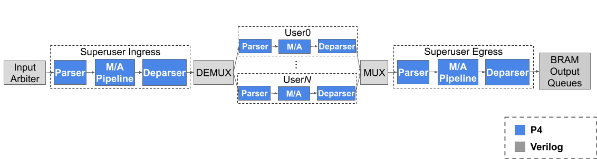

# P4-NetFPGA-MTPSA

MTPSA (Multi Tenant Programmable Switch Architecture) extends [PSA](https://p4.org/p4-spec/docs/PSA-v1.1.0.html) with support for data plane virtualization. This repository contains an implementation of MTPSA based on the [P4->NetFPGA](https://github.com/NetFPGA/P4-NetFPGA-public/wiki) workflow.

The MTPSA model consists of *Superuser* pipeline and multiple *User* pipelines.

# Getting started

1. Follow the P4->NetFPGA steps for initial setup: https://github.com/NetFPGA/P4-NetFPGA-public/wiki/Getting-Started#getting-started-guide

2. Execute `run.sh` to compile, run simulation tests, and generate a bitstream (.bit) file.

# Project Directory Description

All project files are stored in a folder under `$P4_PROJECT_DIR` (`contrib-projects/sume-sdnet-switch/projects/`).

- `learning_switch` - Reference switch
- `mtpsa0` - MTPSA with no user pipelines; only Superuser ingress and egress pipelines
- `mtpsa2` - MTPSA with two user pipelines
- `mtpsa3` - MTPSA with three user pipelines
- `mtpsa4` - MTPSA with four user pipelines

The `$P4_PROJECT_DIR/src/*/commands.txt` file can be used to specify the table entries for a particular pipeline.

The `$P4_PROJECT_DIR/testdata` folder contains a `gen_testdata.py` script (one for each pipeline)
that generates applied/expected packets and metadata to be used in the simulations.

## Superuser Pipeline

The Superuser pipeline consists of two P4 programs that correspond to ingress and egress packet processing.

- `$P4_PROJECT_DIR/src/suEgress/suEgress.p4`
- `$P4_PROJECT_DIR/src/suIngress/suIngress.p4`

## User Pipeline

Each User pipeline is defined by a P4 program stored in `$P4_PROJECT_DIR/src/userX/userX.p4` (where `X` is a user identifier).
